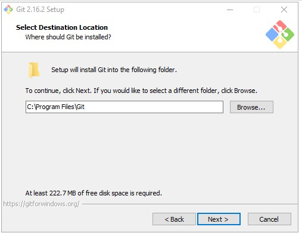
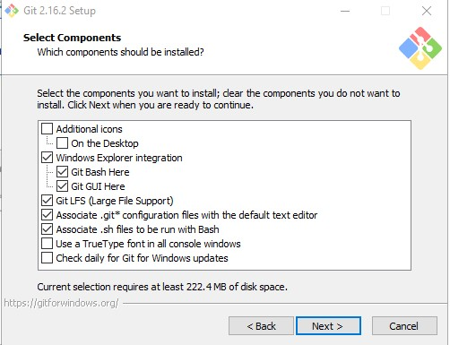
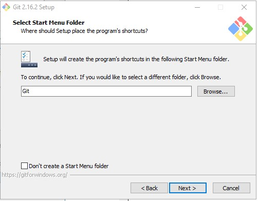
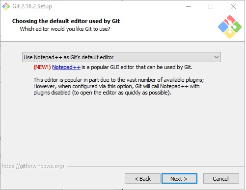
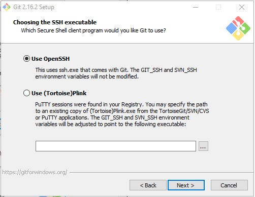
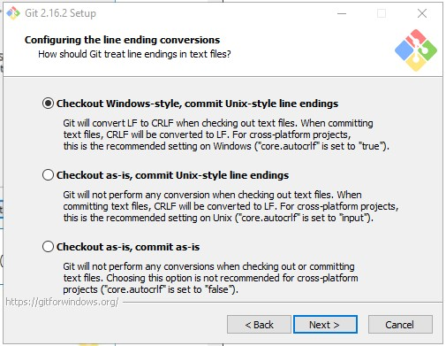
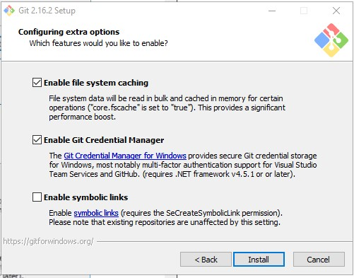

# Instalasi Git Pada WIndows

Terlebih dahulu silahkan mendownload file instalasi git untuk versi Windows [di sini](https://git-scm.com/download/win) . Untuk langkah berikutnya silahkan ikuti langkah-langkah berikut:

1. Double click pada installer Git yang sudah anda download. Dan akan ditampilkan lisensi yang digunakan oleh git. Klik Next.

2. Kemudian akan ditampilkan direktori instalasi Git yang akan digunakan, tinggalkan secara default jika anda tidak ingin mengubahnya dan klik Next.

3. Selanjutnya akan ditampilkan component apa saja yang akan diinstall, tinggalkan default saja dan kemudian klik Next.

4. Kemudian akan ditampilkan opsi untuk Start Menu Folder bagi git yang kita instal, anda bisa mengubah nama folder untuk start menu atau meninggalkannya secara default saja. Kemudian klik Next.

5. Kemudian anda akan diminta untuk memilih default text editor yang akan digunakan oleh Git. Pilih Notepad++ sebagai default text editor dan klik Next.

6. Kemudian anda akan diminta untuk menentukan cara bagaimana anda akan mengakses Git, apakah melalui Command Prompt atau melalui hanya menggunakan Git Bash yang disediakan oleh Git. Pilih opsi menggunakan Command Prompt lalu klik Next

7. Pilih OpenSSL untuk koneksi HTTPS yang akan digunakan Git untuk mengakses repo GitHub.

8. Pilih opsi pertama untuk konversi baris akhir.

9. Pilih PuTTY untuk terminal yang akan digunakan untuk mengakses Git Bash.

10. Pilih opsi pertama dan kedua untuk opsi ekstra yang akan dienable.

11. Selanjutnya tunggu hingga proses instalasi selesai.

12. Kemudian akan muncul dialog pemberitahuan bahwa proses instalasi Git sudah selesai. Klik Finish.

13. Coba cek pada Start Menu dengan mengetikkan Git, jika instalasi berhasil maka akan muncul menu baru bernama Git.

