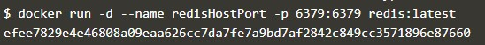

## Part 1 - Deploying Your First Docker Container

  

#### Step 1 - Menjalankan Sebuah Container
1. Jalankan perintah `docker search redis` untuk mencari image di docker hub.

	

2. Jalankan perintah `docker run -d redis` untuk membuat dan menjalankan container redis. Untuk melihat status dari container jalankan perintah `docker ps`

	

#### Step 2 - Menampilkan Container Yang Berjalan
1. Untuk menampilkan container yang berjalan digunakan perintah `docker ps`.

	

#### Step 3 - Mengakses Redis 1
Agar container yang dibuat dapat diakses dari publik, maka container tersebut harus dilakukan expose port.
1. Untuk melakukan expose port, berikan parameter tambahan `-p 6379:6379` pada saat menjalankan perintah docker run. Yang artinya container dapat diakses dari publik menggunakan port 6379.

	

#### Step 4 - Mengakses Redis 2
1. Selain mengekspose dengan menentukan port yang akan digunakan untuk mengakses dari publik,  port exposing dapat juga dilakukan secara dynamic (random port assignment).

	

2. Untuk melihat port berapa yang diberikan oleh docker untuk container yang tadi diekspose, dapat digunakan perintah `docker port redisDynamic`.

	

3. Untuk melihat daftar container yang berjalan, gunakan perintah `docker ps`.

	

#### Step 5 - Mempertahankan Data
	Pada saat kita membuat sebuah container dan kemudian menghapus container tersebut, data-data yang tersimpan dalam containerpun juga akan ikut hilang. Namun permasalahan tersebut dapat diatasi dengan melakukan mount ke sebuah direktori diluar container, sehingga data pada container tidak akan ikut hilang ketika container dihapus.
	
	
	
#### Step 6 - Menjalankan Kontainer pada Foreground
Untuk menjalankan container tanpa mode detached (tanpa menggunakan parameter -d), bisa dilakukan dengan menjalankan perintah `docker run` secara langsung.

1. Perintah berikut akan menjalankan sebuah container Ubuntu dan kemudian menjalankan perintah `ps` untuk melihat semua proses yang berjalan pada container tersebut. 	
	
	

2. Untuk mengakses container, dapat digunakan perintah `docker run -it ubuntu bash`.
	

## Part 2 - Deploy Static HTML Website as Container
In this scenario, you'll learn how to create a Docker Image for running a static HTML website using Nginx. The scenario will explain how to build a Docker Image running Nginx with your HTML site.

### Step 1 - Membuat Dockerfile
Membuat Dockerfile untuk membuild image yang nanti akan digunakan untuk membuat webserver.
	
	
### Step 2 - Build Docker Image
1. Membuild image menggunakan perintah `docker build`.

	

2. Menampilkan daftar image yang tersedia pada host.

	

### Step 3 - Menjalankan Container
1. Menjalankan container menggunakan image yang tadi dibuild.

	

2. Mengakses web server melalui curl.

	

3. Mengakses aplikasi melalui web browser.

	

## Part 3 - Building Container Images

### Step 1 - Base Images
### Step 2 - Menjalankan Commands
### Step 3 - Mengekspose Port
### Step 4 - Default Commands
### Step 5 - Building Container
### Step 6 - Menggunakan Container dengan Image Baru

