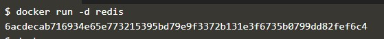

## Part 1 - Deploying Your First Docker Container
#### Step 1 - Menjalankan Sebuah Container
1. Jalankan perintah `docker search redis` untuk mencari image di docker hub.

2. Jalankan perintah `docker run -d redis` untuk membuat dan menjalankan container redis. Untuk melihat status dari container jalankan perintah `docker ps`

#### Step 2 - Menjalankan Kontainer Redis
#### Step 3 - Menjalankan Kontainer
#### Step 4 - Menjalankan Kontainer
#### Step 5 - Menjalankan Kontainer
#### Step 6 - Menjalankan Kontainer

## Part 2 - Deploy Static HTML Website as Container
## Part 3 - Building Container Images

  

