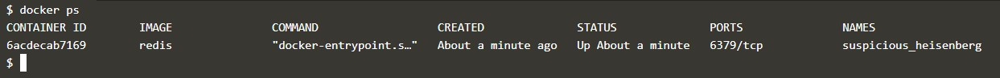
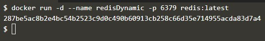
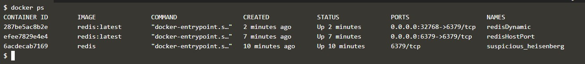

## Part 1 - Deploying Your First Docker Container
#### Step 1 - Menjalankan Sebuah Container
1. Jalankan perintah `docker search redis` untuk mencari image di docker hub.

2. Jalankan perintah `docker run -d redis` untuk membuat dan menjalankan container redis. Untuk melihat status dari container jalankan perintah `docker ps`

#### Step 2 - Menampilkan Container Yang Berjalan
1. 

#### Step 3 - Mengakses Redis 1
Agar container yang dibuat dapat diakses dari publik, maka container tersebut harus dilakukan port expose.
1. 

#### Step 4 - Mengakses Redis 2
1. Selain mengekspose dengan menentukan port yang akan digunakan untuk mengakses dari publik,  port exposing dapat juga dilakukan secara dynamic (random port assignment).

2. Untuk melihat port berapa yang diberikan oleh docker untuk container yang tadi diekspose, dapat digunakan perintah `docker port redisDynamic`.

3. Untuk melihat daftar container yang berjalan, gunakan perintah `docker ps`.

#### Step 5 - Menjalankan Kontainer
#### Step 6 - Menjalankan Kontainer

## Part 2 - Deploy Static HTML Website as Container
## Part 3 - Building Container Images

  

