# Docker Network

  

## Menggunakan Link

Salah satu cara untuk menghubungkan container satu dengan container lainnya pada docker adalah menggunakan Link. Docker Link merupakan sebuah fitur yang memungkinkan kita untuk mengijinkan container untuk melakukan discovery dengan container lainnya dan dapat melakukan pertukaran informasi antar container secara aman.

1. Menjalankan Redis.

	Untuk percobaan jalankan sebuah redis server pada container yang nantinya akan kita hubungkan dengan container lainnnya.
	
	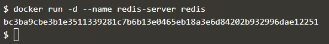

2. Membuat link
	
	Untuk terhubung ke sebuah container digunakan tambahan opsi  `--link <container-name|id>:<alias>` pada perintah saat dilakukan launching container baru.

	Cara kerja dari link ini pertama Docker akan membuat sebuah environment berdasarkan pada container yang saling terhubung. Environment ini nantinya akan memberikan sebuah informasi referensi seperti Port dan IP Address dari container.

	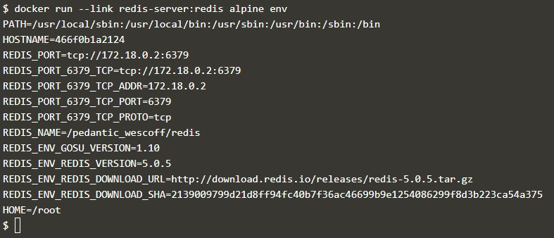

	Selanjutnya Docker akan mengupdate file HOSTS dari container dengan sebuah entry untuk container asal dengan tiga nama, yaitu: asal, alias dan hash-id.

	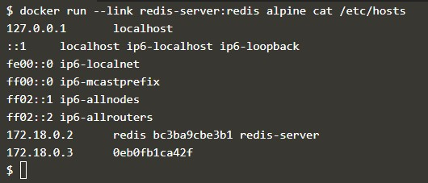

	Setelah link terbentuk, kita dapat melakukan ping ke source container.

	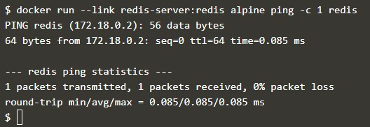

3. Menghubungkan aplikasi

	Dengan dibuatnya link, aplikasi dapat terhubung dan berkomunasi dengan source container dengan cara yang biasa.

	Berikut adalah salah satu contoh aplikasi sederhana dari node.js yang terhubung dengan redis menggunakan hostname redis.

	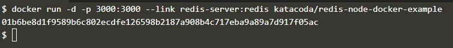

	Untuk mengetes koneksi dapat digunakan perintah `curl docker:3000`

	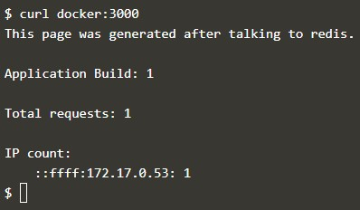

4. Menghubungkan ke CLI Redis

	Selain menghubungkan aplikasi dengan source container, kita juga dapat menghubungkannya dengan tool CLI mereka sendiri.

	Jalankan CLI dari Redis

	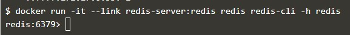

	Jalankan perintah `KEYS *` untuk menampilkan konten yang saat ini disimpan dalam source container redis

	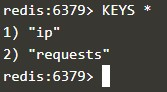

	Ketikkan perintah `QUIT` untuk keluar dari CLI

	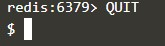

## Menggunakan Docker Network  
Selain menggunakan link, dapat pula digunakan network untuk saling berkomunikasi antar container.
1. Membuat Network Baru

####	Membuat Network
	
	Untuk membuat sebuah network yang nantinya akan digunakan untuk komunikasi antar container dapat digunakan syntax `docker network create`
	
	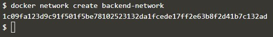
	
####	Menghubungkan ke sebuah Network
	
	Selanjutnya untuk menghubungkan sebuah container ke sebuah network, pada saat dilakukan running container ditambahkan parameter `--net=[nama network]`
	
	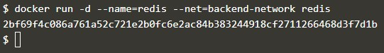

2. Komunikasi Dalam Sebuah Network

	Docker Network bersifat seperti network traditional dimana node dapat dihubungkan dan didisconnect.
	Hal pertama yang akan kita sadari yaitu bahwa Docker tidak lagi melakukan assign environment variable ataupun mengupdate file hosts yang berada pada container.

	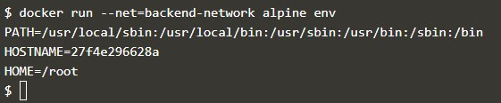

	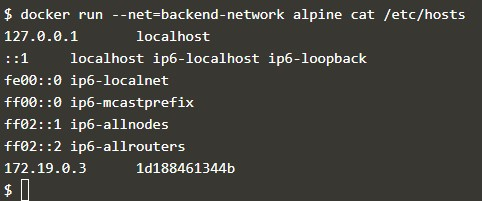

	Terlihat informasi yang tersimpan dalam file hosts container.
	Cara dari container untuk saling berkomunikasi melalui Embedded DNS Server pada Docker.  DNS ini diassign ke semua container melalui IP 127.0.0.11 dan terkonfigurasi pada file resolv.conf

	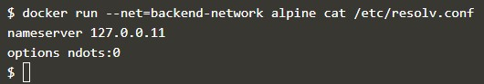

	Ketika sebuah container mencoba untuk mengakses container lain melalui sebuah nama container, maka DNS akan mengambalikan IP Address dari container yang dimaksud.

	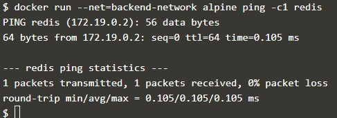

3. Menghubungkan Dua Container
4. Membuat Aliases
5. Memutuskan Container

