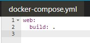
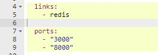
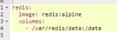
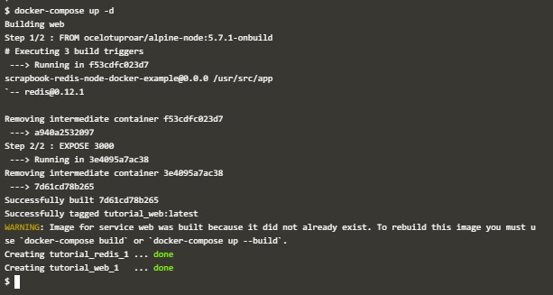
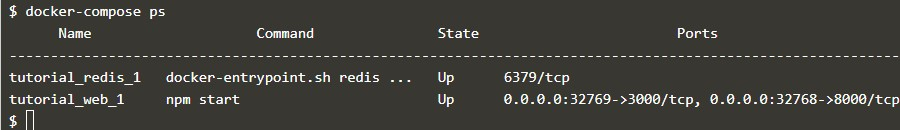
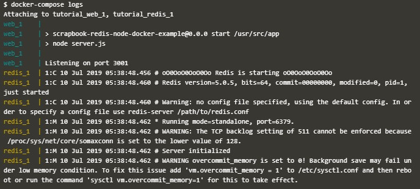
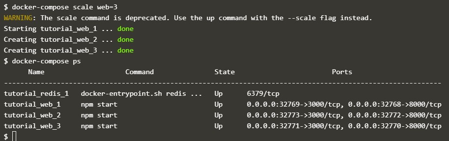
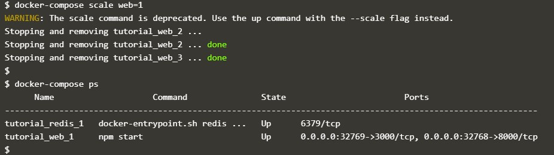
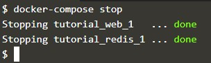
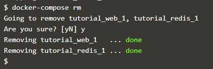

# Docker Compose

  

## Orchestration Using Docker Compose

	Docker Compose berjalan berdasarkan apa yang ada pada file docker-compose.yml. File tersebut mendefinisikan semua container dan pengaturan yang dibutuhkan untuk membuat sebuah cluster.

1. Mendefinisikan Container Pertama

	Pada file yml didefinisikan nama dari container yaitu web dan dibuild pada direktori  yang aktif saat ini.
	
	

2. Mendefinisikan Pengaturan
	
	Pada compose juga didefinisikan pengaturan yang berkaitan dengan container, seperti links yang digunakan untuk menghubungkan container satu dengan yang lainnya dan ports yang digunakan oleh aplikasi.
	
	

3. Mendefinisikan Container Kedua

	Pada file yml yang sama didefinisikan pembuatan container kedua, bernama redis. Dengan image yang diambil dari redis:alpine dan volume yang digunakan pada `/var/redis/data: /data`
	
	
	
4. Docker Up
	
	Untuk menjalankan docker compose digunakan `docker-compose up -d`
	
	
	
5. Docker Management
	
	Docker Compose tidak hanya mengelola pembuatan container tapi juga dapat digunakan untuk mengelola semua container dengan hanya menggunakan satu perintah.
	
	Untuk melihat daftar container yang berjalan dapat digunakan perintah `docker-compose ps`
	
	
	
	Untuk melihat logs dari semua container yang berjalan dapat digunakan perintah `docker-compose logs`
	
	
	
6. Docker Scale
	
	Docker Compose juga dapat digunakan untuk melakukan scale pada container yang menjalankan aplikasi. Scale memungkinkan kita untuk menetapkan berapa banyak service dan instance yang kita inginkan untuk menjalankan aplikasi yang kita buat.
	Untuk melakukan scale container dapat dilakukan dengan cara menjalankan syntax `docker-compose scale`
	
	
	
	Untuk scale down dapat dilakukan dengan mengubah nilai dari scale 
	
	
		
7. Docker Stop
	
	Untuk menghentikan semua container yang berjalan secara sekaligus dapat digunakan perintah `docker-compose stop`
	
	
	
	Sedangkan untuk menghapus semua container dapat digunakan perintah `docker-compose rm`
	
	

# Docker Swarm

  

## Getting Started With Swarm Mode

1. Inisialisasi Mode Swarm
2. Join Cluster
3. Membuat Overlay Network
4. Deploy Service
5. Inspect State
6. Scale Service