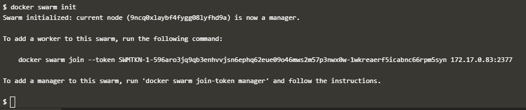
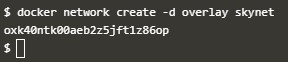
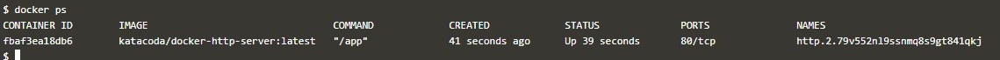

# Docker Compose

  

## Orchestration Using Docker Compose

	Docker Compose berjalan berdasarkan apa yang ada pada file docker-compose.yml. File tersebut mendefinisikan semua container dan pengaturan yang dibutuhkan untuk membuat sebuah cluster.

1. Mendefinisikan Container Pertama

	Pada file yml didefinisikan nama dari container yaitu web dan dibuild pada direktori  yang aktif saat ini.
	
	

2. Mendefinisikan Pengaturan
	
	Pada compose juga didefinisikan pengaturan yang berkaitan dengan container, seperti links yang digunakan untuk menghubungkan container satu dengan yang lainnya dan ports yang digunakan oleh aplikasi.
	
	

3. Mendefinisikan Container Kedua

	Pada file yml yang sama didefinisikan pembuatan container kedua, bernama redis. Dengan image yang diambil dari redis:alpine dan volume yang digunakan pada `/var/redis/data: /data`
	
	
	
4. Docker Up
	
	Untuk menjalankan docker compose digunakan `docker-compose up -d`
	
	
	
5. Docker Management
	
	Docker Compose tidak hanya mengelola pembuatan container tapi juga dapat digunakan untuk mengelola semua container dengan hanya menggunakan satu perintah.
	
	Untuk melihat daftar container yang berjalan dapat digunakan perintah `docker-compose ps`
	
	
	
	Untuk melihat logs dari semua container yang berjalan dapat digunakan perintah `docker-compose logs`
	
	
	
6. Docker Scale
	
	Docker Compose juga dapat digunakan untuk melakukan scale pada container yang menjalankan aplikasi. Scale memungkinkan kita untuk menetapkan berapa banyak service dan instance yang kita inginkan untuk menjalankan aplikasi yang kita buat.
	Untuk melakukan scale container dapat dilakukan dengan cara menjalankan syntax `docker-compose scale`
	
	
	
	Untuk scale down dapat dilakukan dengan mengubah nilai dari scale 
	
	
		
7. Docker Stop
	
	Untuk menghentikan semua container yang berjalan secara sekaligus dapat digunakan perintah `docker-compose stop`
	
	
	
	Sedangkan untuk menghapus semua container dapat digunakan perintah `docker-compose rm`
	
	

# Docker Swarm

  

## Getting Started With Swarm Mode

1. Inisialisasi Mode Swarm

	Untuk melihat daftar command yang dapat dijalankan pada swarm mode dapat dilakukan dengan menjalankan syntax `docker swam --help`

	

	Untuk memulai mode swarm dilakukan dengan menjalankan syntax `docker swarm init`

	

2. Join Cluster

	Untuk bergabung dengan sebuah cluster, melalui host2 kita harus melakukan request token ke manager dengan menjalankan syntax berikut

	

	Lalu gunakan syntax `docker swarm join` untuk bergabung dengan swarm tersebut

	

	Kemudian melalui host1 (manager) jalankan syntax `docker node ls` untuk melihat daftar node yang tergabung dalam cluster.

	

3. Membuat Overlay Network

	Pada Swarm Mode dikenalkan pula sebuah peningkatan pada model jaringan yang ada. Overlay Network digunakan agar container yang berada pada host lain dapat berkomunikasi dengan host lainnya melalui Virtual Extensible LAN (VXLAN), yang didesign untuk deployment pada cloud dengan skala yang besar.

	Untuk membuat overlay network pada docker swarm dapat dilakukan dengan syntax `docker network create -d noverlay`

	

4. Deploy Service

	Secara default, Docker menggunakan model spread replication untuk menentukan dimana container harus dijalankan pada sebuah host. Pendekatan ini memastikan bahwa container  dideploy ke semua cluster secara merata.

	Untuk menjalankan request load balance Docker ke semua container yang tersedia pada sebuah cluster dapat digunakan syntax `docker service create --name http --network skynet --replicas 2 -p 80:80 katacoda/docker-http-server`

	

	Untuk melihat daftar service yang berjalan pada sebuah cluster dapat digunakan syntax `docker service ls`

	

	Pada masing-masing host jalankan syntax `docker ps` untuk melihat instance dari container pada setiap host

	

	

	Ketika kita menjalankan request `curl` ke public port maka request tersebut akann dijalankan oleh dua container

	

5. Inspect State

	Konsep yang dimiliki oleh Service mengijinkan kita untuk melakukan inspeksi pada health dan state pada cluster dan aplikasi yang berjalan.

	Untuk melihat daftar task yang berhubungan dengan sebuah service pada cluster dapat digunakan syntax `docker service ps http`

	

	Untuk melihat detail dan konfigurasidari sebuah service dapat digunakan syntax `docker service inspect --pretty http`

	

	Pada setiap node, kita dapat melakukan request untuk melihat task apa saja yang saat ini berjalan dengan syntax `docker node ps self`

	

	Menggunakan ID dari sebuah node, kita bisa melakukan query untuk masing-masing host

	

6. Scale Service

	Service juga memungkinkan kita untuk melakukan scale pada berapa banyak instance dari sebuah task dijalankan pada cluster.

	Pada saat ini kita telah memiliki dua buah container yang sudah diload balance yang memproses request dari kita

	

	Untuk melakukan scale pada service dapat digunakan syntax `docker service scale http=5`

	

	Pada masing-masing host kita dapat mengecek node mana saja yang mulai dijalankan

	

	Ketika coba dilakukan request ke aplikasi, load balancer secara otomatis terupdate dan request yang dilakukan diproses ke semua container yang ada pada cluster.

	