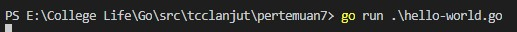
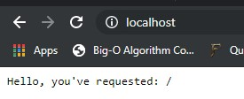
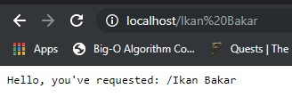
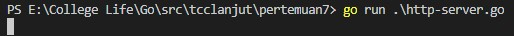

# GO WEB

<p align="center">
  
</p>

## Hello World

Go merupakan sebuah bahasa pemrograman yang memiliki webserver built in. Package net/http merupakan library standar yang berisikan semua fungsionalitas untuk protocol HTTP. Termasuk sebuah client HTTP dan server HTTP.


1. **Registering a Request Handler**

	Pertama, buat sebuah Handler yang digunakan untuk menerima semua koneksi HTTP yang masuk dari browser, client HTTP ataupun request API. Handler pada Go adalah sebuah fungsi yang memiliki struktur sebagai berikut
	
	`func (w http.ResponWritter, r *http.Request)`

	Fungsi tersebut memiliki dua parameter, yaitu:
	
	1. `http.ResponWriter` yang digunakan untuk memberikan respon teks/html
	2. `http.Request` yang berisikan semua informasi mengenai request HTTP, termasuk url maupun header. 

	Untuk mendaftarkan sebuah request handler sebagai HTTP Server default dapat dilakukan dengan cara yang sederhana seperti dibawah ini:

	```
	 http.HandleFunc("/", func (w http.ResponseWriter, r  *http.Request) {
		fmt.Fprintf(w, "Hello, you've requested: %s\n", r.URL.Path)
	 })

	```
2. **Listen for HTTP Connections**

	Request hanlder saja tidak dapat menerima setiap koneksi HTTP dari luar. Sebuah server HTTP harus melakukan listen pada sebuah port untuk melewatkan koneksi ke request handler. Secara default port yang digunakan untuk request HTTP adalah port 80.

	Untuk menambahkan listen port pada webserver maka tambahkan code berikut:

	`http.ListenAndServe(":80",nil)`

	Kemudian melalui terminal jalankan code program dengan perintah `go run`

	

	Kemudian melalui browser coba akses ke localhost

	

	Tambahkan string dibelakang alamat localhost

	


## HTTP Server

HTTP server secara mendasar memiliki beberapa tugas utama yaitu:

* Memproses request dynamic

	Memproses setiap request yang masuk dari user yang mengakses website, masuk ke akun mereka atau memposting image

* Melayani asset static

	Melayani Javascript, CSS dan gambar ke browser yang menciptakan pengalaman dynamic ke user.

* Menerima koneksi

	Server HTTP harus listen ke sebuah port yang spesific agar dapat menerima koneksi dari internet.


1. **Process dynamic requests**

	Paket net/http berisikan semua utilitas untuk menerima request dan menghandlenya secara dynamic. Kita bisa mendaftarkan handler baru dengan fungsi `http.HttpFunc`. Parameter pertamanya mengarahkan ke sebuah path untuk dicocokkan dan sebuah fungsi untuk kemudian dieksekusi.

	```
	http.HandleFunc("/", func(w http.ResponseWriter, r *http.Request){
		fmt.Fprint(w, "Welcome to my website!")
	})

	```

	Untuk aspek dinamisnya, http.Request berisikan semua informasi mengenai request dan parameternya. Kita bisa membaca parameter GET dengan `r.URL.Query().Get("token")` atau parameter POST (yang merupakan field dari form HTML) dengan `r.FormValue("email")` 

2. **Serving static assets**

	Untuk melayani aset statis seperti JavaScript, CSS dan gambar, kita dapat menggunakan fungsi built in `http.FileServer` dan melakukan pointing ke path dari file tersebut. Agar dapat berjalan secara benar perlu diberikan informasi mengenai asal dari file tersebut.

	```
	fs := http.FileServer(http.Dir("static/"))
	
	```

	Setelah semua telah terkonfigurasi, kita perlu melakukan pointing ke parth url, seperti yang kita lakukan pada request dinamis.

	```
	http.Handle("/static", httpStripPrefix("/static/", fs))

	```

3. **Accept Connections**

	Hal terakhir yang perlu dilakukan agar server HTTP dapat berjalan adalah melakukan listen ke port agar dapat menerima koneksi dari internet. 

	```
	http.ListenAndServe(":80", nil)

	```

	Melalui terminal, jalankan file dengan menggunakan `go run`

	

	Kemudian akses localhost melalui browser

	[05](images/ss5.jpg)

## Go Route

Paket `net/http` milik Go menyediakan banyak fungsionalitas untuk protocol HTTP. Satu hal yang kurang bisa dihandle adalah request routing yang kompleks, seperti segmentasi sebuah request url dalam satu parameter. Hal tersebut dapat diatasi dengan paket `gorilla/mux` yang dapat digunakan untuk membuat route dengan parameter, handler untuk GET/POST dan domain restrictions.

1. **Installing the `gorilla/mux` package**

	`gorilla/mux` merupakan sebuah paket yang berasal dari adaptasi HTTP router milik Go. Paket ini memiliki bayak fitur yang dapat digunakan untuk meningkankan produktivitas disaat membuat sebuah aplikasi web.

	Untuk melakukan instalasi paket tersebut, dapat dilakukan dengan perintah

	`go get -u github.com/gorilla/mux`

	[06](images/ss6.jpg)

2. **Creating a new Router**

	Pertama, buat sebuah router untuk request. Router ini merupakan main router untuk aplikasi web yang kita buat dan selanjutnya akan dilewatkan sebagai parameter ke server. Router ini akan menerika semua koneksi HTTP dan melewatkannya ke request handler yang nanti akan didaftarkan.

	Untuk membuat router dapat dilakukan dengan cara berikut

	`r :=  mux.NewRouter()`

3. **Registering a Request Handler**

	Setelah router dibuat, kita dapat mendaftarkan handler seperti biasanya. Bedanya, kita tidak lagi menggunakan `http.HandleFunc(...)` tapi digantikan dengan cara berikut `r.HandleFunc(...)`

4. **URL Parameters**

	Salah satu keunggulan dari `gorilla/mux` adlah kemampuannya untuk melakukan ekstraksi segment dari request url. Sebagai contoh, dibawah ini adalah url dari aplikasi yang kita buat

	`/books/go-programming-blueprint/page/10`

	Pada url tersebut terdapat dua segment dinamis, yaitu:

	1. Sebuah buku berjudul **go-programming-blueprint**
	2. Halaman **10**

	Agar request handler mencocokkan url di atas, kita harus mengubah segment dimanis menjadi seperti berikut:

	```

	r.HandleFunc("/books/{title}/page/{page}", func(w http.ResponseWriter, r *http.Request) {
	// get the book
	// navigate to the page
	})

	```

	Selanjutnya kita harus mengambil data dari segment tersebut. `gorilla/mux` memiliki sebua fungsi, yaitu `mux.Vars(r)` yang mengambil `http.Request` sebagai parameter dan mengmablikannya sebagai sebuah map dari segment.

	```
	func(w http.ResponseWriter, r *http.Request) {
		vars := mux.Vars(r)
		vars["title"] // the book title slug
		vars["page"] // the page
	}

	```

5. **Setting the HTTP server router**

	Jika kita menilik ke belakang, pada setiap deklarasi listen pada server http terdapat parameter `nil`, parameter tersebut adalah parameter untuk main router dari server HTTP. Secara default `nil` berarti menggunakan router default yaitu `net/http`. Agar kita bisa menggunakan router kita sendiri, ubah `nil` menjadi `r` yang merupakan variabel dari router yang kita buat.

	`http.ListenAndServe(":80", r)`
